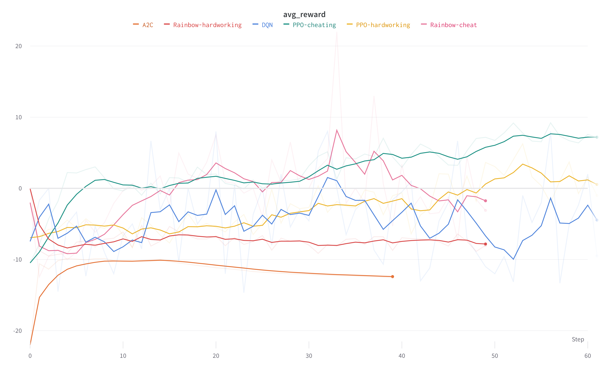

# Snake env

<p align="center">
  
</p>

## Introduction

* The snake environment supports 4 actions: **[up, right, down, top]**.
* The snake environment will have extra blocks for better learning.
* The head is denoted with blue color and the rest of the body is black.
* The apple is red.
* Reward is designed as below:
  <table>
    <tr>
        <td colspan="2"><strong>Description</strong></td>
        <td><strong>Reward</strong></td>
    </tr>
    <tr>
        <td colspan="2">Eat apple</td>
        <td>+20</td>
    </tr>
    <tr>
        <td colspan="2">Crush on walls</td>
        <td>-10</td>
    </tr>
    <tr>
        <td rowspan="2">Others</td>
        <td>cheat</td>
        <td>prev_target_dis - cur_target_dis</td>
    </tr>
    <tr>
        <td>hardworking</td>
        <td>-0.03 * snake_length</td>
    </tr>
  </table>

### Install the snake env

```shell
$ git clone https://github.com/JoyPang123/snake_env.git
$ cd snake_env
$ pip install -e snake
```

### Play around with the snake environment

After installing the environment, users can test it using:

```shell
$ python snake_env_display.py
```

### Test the files

The test files are included in `test`. `test/envs` is for snake environment and `test/models` is for models' output dimension check.

```shell
$ python -m pytest -v test
```

### Install the dependencies

```shell
$ pip install -r requirements.txt
```

## Snake environment API

There are three parameters:

* `mode`: `str`
  Control two different modes - cheat and hardworking.
* `max_iter`: `int`
  Maximum steps for an episode
* `render`: `str`
  Use pygame or pyglet to render the environment

```python
# Default arguments
env = gym.make("snake:snake-v0", mode="cheat", max_iter=1000, redner="pyglet")
```

## Docker Environment

The docker environment is also provide.

### Install and run

```shell
(Terminal)
$ docker build -t snake Dockerfile
$ source Dockerfile/run_docker.sh
```

### Remove the image

```shell
$ docker rmi snake
```

## Experiments

### Lunar

* We first test the program on `lunar` environment:
  
* Access to [asset folder](assets/lunar) to see our final result.

### Snake



* If we use `cheat` mode, the snake will not learn to eat apple but trying to approach apple only

<br/>
<p align="center">
  
  
  <br>Fig. (Left) Rainbow cheating. (Right) PPO cheating
</p>

* Below results are training with `hardworking` mode:
  <br/>

<p align="center">
  
  
  <br>Fig. (Left) Rainbow hardworking. (Right) PPO hardworking
</p>

> We found that when training rainbow on hardworking mode, it will always go up. Having no idea of the results😢.

## Algorithm


| Algorithm                                                                                | Directory                                          | Colab                                                                                                                                                                                   |
| ------------------------------------------------------------------------------------------ | ---------------------------------------------------- | ----------------------------------------------------------------------------------------------------------------------------------------------------------------------------------------- |
| A2C[(reference)](https://github.com/ikostrikov/pytorch-a2c-ppo-acktr-gail)               | [src/A2C_algo](src/A2C_algo)                       | [](https://colab.research.google.com/github/JoyPang123/snake_env/blob/main/src/A2C_algo/A2C.ipynb)            |
| DQN                                                                                      | [src/DQN_algo](src/DQN_algo)                       | [](https://colab.research.google.com/github/JoyPang123/snake_env/blob/main/src/DQN_algo/DQN.ipynb)            |
| DDPG[(reference)](https://github.com/LxzGordon/Deep-Reinforcement-Learning-with-pytorch) | [src/DDPG_algo](src/DDPG_algo)                     | [](https://colab.research.google.com/github/JoyPang123/snake_env/blob/main/src/DDPG_algo/DDPG_Discrete.ipynb) |
| PPO[(reference)](https://github.com/nikhilbarhate99/PPO-PyTorch)                         | [src/PPO_algo](src/PPO_algo)                       | [](https://colab.research.google.com/github/JoyPang123/snake_env/blob/main/src/PPO_algo/PPO.ipynb)            |
| Rainbow                                                                                  | [Kaixhin repo](https://github.com/Kaixhin/Rainbow) | See repo                                                                                                                                                                                |

## Citation

```bib
@inproceedings{NIPS1999_6449f44a,
 author = {Konda, Vijay and Tsitsiklis, John},
 booktitle = {Advances in Neural Information Processing Systems},
 editor = {S. Solla and T. Leen and K. M\"{u}ller},
 pages = {},
 publisher = {MIT Press},
 title = {Actor-Critic Algorithms},
 url = {https://proceedings.neurips.cc/paper/1999/file/6449f44a102fde848669bdd9eb6b76fa-Paper.pdf},
 volume = {12},
 year = {2000}
}

@article{mnih2013playing,
  title={Playing atari with deep reinforcement learning},
  author={Mnih, Volodymyr and Kavukcuoglu, Koray and Silver, David and Graves, Alex and Antonoglou, Ioannis and Wierstra, Daan and Riedmiller, Martin},
  journal={arXiv preprint arXiv:1312.5602},
  year={2013}
}

@article{lillicrap2015continuous,
  title={Continuous control with deep reinforcement learning},
  author={Lillicrap, Timothy P and Hunt, Jonathan J and Pritzel, Alexander and Heess, Nicolas and Erez, Tom and Tassa, Yuval and Silver, David and Wierstra, Daan},
  journal={arXiv preprint arXiv:1509.02971},
  year={2015}
}

@article{brockman2016openai, 
  title={Openai gym}, 
  author={Brockman, Greg and Cheung, Vicki and Pettersson, Ludwig and Schneider, Jonas and Schulman, John and Tang, Jie and Zaremba, Wojciech}, 
  journal={arXiv preprint arXiv:1606.01540}, 
  year={2016} 
}

@article{schulman2017proximal,
  title={Proximal policy optimization algorithms},
  author={Schulman, John and Wolski, Filip and Dhariwal, Prafulla and Radford, Alec and Klimov, Oleg},
  journal={arXiv preprint arXiv:1707.06347},
  year={2017}
}

@inproceedings{hessel2018rainbow,
  title={Rainbow: Combining improvements in deep reinforcement learning},
  author={Hessel, Matteo and Modayil, Joseph and Van Hasselt, Hado and Schaul, Tom and Ostrovski, Georg and Dabney, Will and Horgan, Dan and Piot, Bilal and Azar, Mohammad and Silver, David},
  booktitle={Thirty-second AAAI conference on artificial intelligence},
  year={2018}
}

@misc{wandb,
  title = {Experiment Tracking with Weights and Biases},
  year = {2020},
  note = {Software available from wandb.com},
  url={https://www.wandb.com/},
  author = {Biewald, Lukas},
}
```
